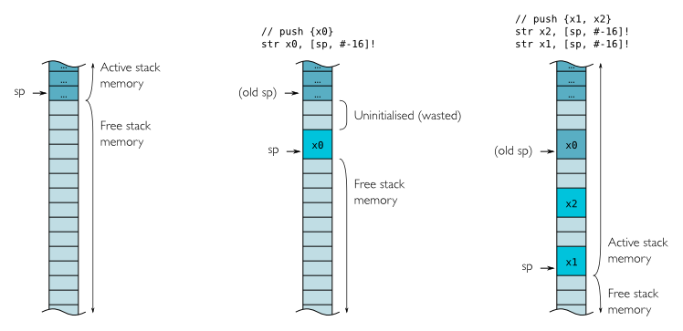

# Projektarbeit GTI

## Teammitglieder

- Jenni, Marc *marc.jenni1@students.ffhs.ch*
- Zehnder, Kevin *kevin.zehnder@students.ffhs.ch*

## Beschreibung des Projekts / Abstract

Wir zeigen in diesem Projekt auf, wie in einer "Bare-Metal" Umgebung mit ARM Assembler eine LED angesteuert und kontrolliert werden kann. Wir verwenden die LED anschliessend zur Ausgabe eines Morsesignales. Das Projekt wird auf einem Raspberry Pi3 realisiert.

## Einleitung

### Vorbereitende Lektüre

Um die grundsätzliche Funktionsweise der Hardware zu verstehen, bietet sich der JOHNNY Simulator an [1]. Dieser simuliert einen sehr einfachen Prozessor und visualisiert die inneren Abläufe auf verschiedenen Abstraktionsebenen. Es lassen sich einfache Assembler Programme schreiben und schrittweise abspielen um zu verstehen, wie die Hardware die Befehle abarbeitet. Diese Thematik ist Grundlage für das vorliegende Projekt, wird aber an dieser Stelle nicht näher behandelt.

> Referenzen:
>
> [1] Johnny Simulator: <http://ffhs.wbportal.ch/JOHNNY/Johnny-Manual-DE.pdf>

### ARM - Architektur, Design und Funktion

Die ARM-Architektur ist ein Mikroprozessor-Design, das von ARM Limited [2] weiterentwickelt wird.  Das Unternehmen ARM Limited stellt keine eigenen [ICs](https://de.wikipedia.org/wiki/Integrierter_Schaltkreis) her, sondern vergibt unterschiedliche [Lizenzen](https://de.wikipedia.org/wiki/Lizenz) an Halbleiter-Entwicklungsunternehmen und Halbleiterhersteller. ARM-Implementierungen sind im Embedded-Bereich die meistgenutzte Architektur. Fast alle derzeitigen Smartphones und Tabletcomputer haben lizenzierte ARM-Prozessoren, darunter das iPhone und die meisten Android-Geräte. Die ARM Architektur zeichnet sich durch einen effizienten Befehlssatz aus, der sich besonders gut für die Optimierung der Stromaufnahme eignet - ein wichtiges Kriterium im mobilen Bereich.

### Befehlssatz und Programmiermodell

Die ARM-CPU ist eine [RISC](https://de.wikipedia.org/wiki/Reduced_Instruction_Set_Computer)-Architektur und kennt als solche drei Kategorien von Befehlen:

- Befehle zum Zugriff auf den Speicher (Load/Store),
- arithmetische oder logische Befehle für Werte in Registern,
- Befehle zum Ändern des Programmflusses (Sprünge, Unterprogrammaufrufe).

#### Registersatz

Register r0 bis r12 sind Universalregister. Drei zusätzliche Register r13, 14, r15 sind wie Universal-Register adressierbar, haben aber spezifische Bedeutungen. Diese sind ein Stackpointer `r13`, ein Link-Register `r14`, sowie der Program-Counter `r15`.

#### Adressierungsarten

Ein Standardbefehl ist 32 Bit lang. Dadurch ist es nicht ohne Weiteres möglich mit einem einzigen Befehl direkt
32-Bit Adressen anzusteuern. Eine Lösung dieses Problems besteht zum Beispiel in der vorherigen Speicherung
einer solchen Adresse in ein Register.

#### Besonderheiten der Architektur

Der ARM-Befehlssatz enthält einige Besonderheiten, die zur Effizienz der Architektur beitragen:

- Praktisch alle Befehle können bedingt ausgeführt werden ("conditional execution"). Damit entfällt in vielen Standardsituationen die Notwendigkeit für Programmsprünge, z. B. in vielen If/Else-Abfragen (man vermeidet Programmsprünge, weil diese die [Pipeline](https://de.wikipedia.org/wiki/Pipeline_(Prozessor)) des Prozessors leeren, und dadurch Wartezyklen entstehen). Zum Kodieren der Bedingung werden die ersten 4 Bits eines jeden Befehles im Maschinencode bzw. ein Suffix im [Mnemonic](https://de.wikipedia.org/wiki/Assemblersprache) verwendet.

#### Thumb Befehlssatz

Neben dem normalen ARM-Befehlssatz existiert ein zusätzlicher „Thumb“-Befehlssatz. Dieser besteht aus 16-Bit
breiten Befehlen, wodurch eine Reduzierung der Code-Größe um etwa 30- 40% erreicht wird. Dies geschieht auf
Kosten der Geschwindigkeit. Thumb-Befehle kennen keine bedingte Ausführung, sondern nur bedingte Sprünge.
In der 8. Version der ARM-Architektur existieren zwei Ausführungsmodi. AArch32 dient der Ausführung von
32-Bit-Software unter Verwendung des herkömmlichen ARM-Befehlssatzes, während AArch64 64 Bit-Software
verarbeitet und den neuen Befehlssatz A64 zur Verfügung stellt. Der A64 Befehlssatz stellt 31 Universalregister
zur Verfügung, unterstützt Fließkomma und bringt ein neues Ausnahme-Modell mit.

### ARM v8

 Die achte Version der ARM-Architektur wurde im Oktober 2011 vorgestellt.  Mit ARMv8 wurde erstmals von ARM eine [64-Bit-Architektur](https://de.wikipedia.org/wiki/64-Bit-Architektur) für die Datenverarbeitung und Speicheradressierung realisiert. Die Kompatibilität zur vorhandenen 32-Bit-Software sollte dabei aufrechterhalten werden. ARMv8 ist abwärtskompatibel bis hin zu ARMv5. Es existieren zwei unabhängige Ausführungsmodi: AArch32 für die Verarbeitung von 32-bit-Software und AArch64 für die Verarbeitung von 64-bit-Software.  

> Referenzen:
>
> [2] www.arm.com
>
> [3] <https://de.wikipedia.org/wiki/ARM-Architektur>
>
> [4] <https://alisdair.mcdiarmid.org/arm-immediate-value-encoding/>
>
> [5] <https://developer.arm.com/ip-products/processors/cortex-a/cortex-a53>

## Vorbereitung der Hardware

Der Raspberry Pi 3 ist ein Einplatinencomputer. Er enthält ein Ein-Chip-System (SoC) von Broadcom, mit einer ARM-CPU. Bei dem von uns verwendeten Raspberry Pi 3B+ kommt ein BCM2837B0 SoC Chip zur Anwendung. Dieser beinhaltet eine Broadcom Dual Core Video Core GPU sowie einen ARM-Cortex-A53 CPU (ARMv8).

Der Raspberry Pi 3 verfügt über eine Reihe von GPIO Pins (general-purpose input/output). Diese Pins können via Software als Eingang oder Ausgang zu verschiedenen Zwecken verwendet werden.  GPIO Ausgänge liefern im Logizkzustand 1 eine Spannung von +3.3V, im Logikzustand 0 0 Volt. GPIO Eingänge liefern bei einer Spannung bis +1.7V das Logiksignal 0, bei einer Spannung zwischen +1.7V und +3.3 V das Logiksignal 1. Pin 2 und 4 liefern +5V zur Stromversorgung externer Hardware. Diese Pins dürfen nicht mit einem GPIO Eingang verbunden werden.

Wir erstellen einen einfachen Schaltkreis auf einem Breadboard. GPIO 24 (PIN 18) wird als Out verwendet. Der Stromkreis verläuft durch eine LED und danach zurück zu einem GND PIN. Zur Anpassung des Stromflusses für die LED (bei 3.3V Spannung) wird noch ein Widerstand dazwischengeschalten. Durch aktivieren und deaktivieren von GPIO24 können wir die LED nun ein- oder ausschalten.


> Referenzen:
>
> [6] <https://de.wikipedia.org/wiki/Raspberry_Pi#Hardware>
>
> [7] <https://www.raspberrypi.org/documentation/usage/gpio/>
>
> [8] [Einsatz eines Breadboards.](https://www.cl.cam.ac.uk/projects/raspberrypi/tutorials/robot/breadboard/)
>
> [9] Franzis Raspberry Pi Maker Kit - Die erste LED leuchtet am Raspberry Pi

## Assembler

### Raspberry Pi 3 Bare Metal Boot

Der Raspberry Pi 3 Boot Prozess läuft vereinfacht dargestellt wie folgt ab:

- Stage 1 boot vom on-chip ROM. Lädt Stage 2 in den L2 cache
- Stage 2 ist enthalten in der Datei `bootcode.bin`. Diese aktiviert das SDRAM und lädt `start.elf` in die GPU.
- `start.elf` wird von der GPU ausgeführt. Lädt cmdline.txt, config.txt, issue.txt, kernel.img.  
- `kernel.img` läuft auf dem ARM Prozessor.

Das `kernel.img` beinhaltet Maschinencode. Wir können also eine SD Karte mit einem eigenen kernel.img erstellen und dadurch direkt Code auf der Hardware ausführen lassen, ohne dass ein Betriebssystem läuft.

> Referenzen:
>
> [10] <https://github.com/raspberrypi/firmware/tree/master/boot>
>
> [11] <https://www.embedded.com/building-bare-metal-arm-systems-with-gnu-part-1-getting-started/>
>
> [12] <https://www.embedded.com/building-bare-metal-arm-systems-with-gnu-part-2/>
>
> [13] <https://www.embedded.com/introduction-to-arm-thumb/>
>
> [14] <https://www.raspberrypi.org/documentation/configuration/config-txt/boot.md>
>
> [15] <https://www.raspberrypi.org/documentation/hardware/raspberrypi/bootmodes/bootflow.md>
>
> [16] <http://www.simtec.co.uk/products/SWLINUX/files/booting_article.html>
>
> [17] <https://github.com/bztsrc/raspi3-tutorial>
>
> [18] <http://www.valvers.com/open-software/raspberry-pi/step01-bare-metal-programming-in-cpt1/>

### Toolchain

Zur Entwicklung des kernel.img gibt es verschiedene Werkzeuge. Wir verwenden den FASMARM Compiler, <https://arm.flatassembler.net.> Das FASMARM package ist ein ARM cross-assembler addon für FASM (Flatassembler.net). FASMARM unterstützt derzeit den vollen Befehlssatz für alle 64-bit und 32-bit ARM Prozessoren bis zu v8.

> Referenzen:
>
> [19] <http://infocenter.arm.com/help/index.jsp?topic=/com.arm.doc.dui0204j/Cihcdbca.html>
>
> [20] Details zum Broadcom BCM2835 GPIO Baustein](<https://www.raspberrypi.org/documentation/hardware/raspberrypi/bcm2835/BCM2835-ARM-Peripherals.pdf)>
>
> [21] ARM Instruction Set](<http://www.peter-cockerell.net/aalp/html/frames.html)>
>
> [22] <http://abbts.wbportal.ch/ARM/EuroBSDConARMv8.pdf>
>
> [23] <http://abbts.wbportal.ch/ARM/DDI0500D_cortex_a53_r0p2_trm_ARMv8.pdf>
>
> [24] <http://abbts.wbportal.ch/ARM/AArch64-Reference-Manual.pdf>
>
> [25] <https://www.studica.com/blog/program-embedded-systems-raspberry-pi>
>
> [26] <https://arm.flatassembler.net/>
>
> [27] [GNU Arm Embedded Toolchain](https://developer.arm.com/open-source/gnu-toolchain/gnu-rm/downloads)
>
> [28] Build Tool: [GNU ARM Eclipse Windows Build Tool](https://github.com/gnu-mcu-eclipse/windows-build-tools/releases/tag/v2.8)
>
> [29] <https://devblogs.microsoft.com/cppblog/arm-gcc-cross-compilation-in-visual-studio/>

### ARMv8 Assembler Befehle

Alle ARM Assembler Befehle sind 32 Bit lang und folgen grundsätzlich dem folgenden Schema:

`<operation>{cond}{flags} dest,lhs,rhs`

| Bezeichnung | Bedeutung                                                    |
| ----------- | ------------------------------------------------------------ |
| operation   | Ein Mnemonic für den Assembler-Befehl, wie z.B. MOV oder ADD |
| {cond}      | Eine optionale Bedingung für den Befehl, wie z.B. EQ oder CS |
| {flags}     | Optionale Zusätzliche Flags, wie z.B. S                      |
| dest        | Das Zielregister                                             |
| lhs         | Erster Operand (left-hand-side)                              |
| rhs         | Zweiter Operand (right-hand-side)                            |

Diese grundsätzliche Syntax kann sich bei einigen Befehlen auch unterscheiden. Im Folgenden werden einige konkrete Instruktionen und ihre Funktionsweise gezeigt.

#### MOV (move register)

`MOV dest, rhs`

Der MOV befehl "transportiert" den rhs Operanden ins Zielregister. Für den MOV Befehl ist im Befehlssatz kein lhs Operand definiert.

#### ORR (logical OR)

`ORR  dest, lhs, rhs`

Der ORR Befehl errechnet das logische OR der beiden Operanden.

#### LSL (logical shift left)

`LSL r1, r2, r3`

`LSL` führt eine bitweise logische Verschiebung nach links aus. Bei dieser *logischen Verschiebung* (engl. *logical shift*) werden die hinausgeschobenen Bits verworfen und Nullen nachgezogen.

#### STR (store a word or byte)

`STR source, [base, offset]`

STR speichert Daten an eine spezifische Speicheradresse . Dazu wird eine Syntax mit Offset verwendet. Der Offset kann dabei auch negativ sein.

> **Write-Back mit !**  
> `STR R0, [R1, #-16]!`
> speichert R0 nach R1-16 und macht danach ein automatisches `SUB R1, R1, #16`
> Dies benötigt wegen der Prozessorarchitektur keine zusätzliche Rechenzeit.

#### LDR (load a word or byte)

`LDR dest, [base, offset]`

LDR entspricht dem STR Befehl, wobei in diesem Fall Daten aus einer Speicheradresse gelesen und nicht dorthin geschrieben werden. Daher wird der erste Operand zum Ziel (dest).

#### SUB (subtract)

`SUB dest, lhs, rhs`

Der SUB Befehl subtrahiert rhs von lhs und speichert das Resultat nach dest.

#### CMP (compare)

`CMP r1, r2`

Der CMP Befehl vergleicht zwei Werte und setzt die "condition flags".  

ARM kennt sogenannte "condition flags". Diese werden durch die CMP (compare) Funktion für die vorgehende Operation gesetzt. Die flags zeigen verschiedene Eigenschaften, wie z.B. ob das Resultat negativ war oder ähnliches. Es gibt die folgenden flags:

| Flag        | Bedeutung                                                    |
| ----------- | ------------------------------------------------------------ |
| N: Negative | das N flag wird gesetzt, wenn das Resultat negativ war.      |
| Z: Zero     | das Z flag wird gesetzt, wenn das Resultat = 0 ist.          |
| C: Carry    | das C flag wird gesetzt, wenn das Resultat den 32-bit Register "überfüllt" / overflow hat. |
| V: Overflow | Same as C flag but for signed operations                     |

Das setzen dieser flags lässt sich bei den meisten Befehl auch durch das Suffix S setzen. So wird z.B. anstatt SUB einfach SUBS verwendet, damit die Subtraktion direkt die condition flags setzt. Dadurch kann man auf das anschliessende CMP verzichten.

Nachdem die Flags gesetzt sind, kann man darauf reagieren mit sogenannten "condition codes". Jede Instruktion kann bedingt ausgeführt werden, indem so ein code als Suffix angehängt wird. So z.B. der Sprungbefehl b als bne (Suffix NE). Die folgende Tabelle zeigt die verfügbaren condition codes, ihre Bedeutung und die Flags, die dadurch getestet werden.

| **Code**          | **Meaning (for `cmp` or `subs`)**                      | **Flags Tested**   |
| :---------------- | :----------------------------------------------------- | :----------------- |
| `eq`              | Equal.                                                 | `Z==1`             |
| `ne`              | Not equal.                                             | `Z==0`             |
| `cs` or `hs`      | Unsigned higher or same (or carry set).                | `C==1`             |
| `cc` or `lo`      | Unsigned lower (or carry clear).                       | `C==0`             |
| `mi`              | Negative. The mnemonic stands for "minus".             | `N==1`             |
| `pl`              | Positive or zero. The mnemonic stands for "plus".      | `N==0`             |
| `vs`              | Signed overflow. The mnemonic stands for "V set".      | `V==1`             |
| `vc`              | No signed overflow. The mnemonic stands for "V clear". | `V==0`             |
| `hi`              | Unsigned higher.                                       | `(C==1) && (Z==0)` |
| `ls`              | Unsigned lower or same.                                | `(C==0) || (Z==1)` |
| `ge`              | Signed greater than or equal.                          | `N==V`             |
| `lt`              | Signed less than.                                      | `N!=V`             |
| `gt`              | Signed greater than.                                   | `(Z==0) && (N==V)` |
| `le`              | Signed less than or equal.                             | `(Z==1) || (N!=V)` |
| `al` (or omitted) | Always executed.                                       | None tested.       |

#### B (branch) und BL (branch link) - Sprungbefehle

`B ziel` oder `BL ziel`

Die Instruktion b (branch) setzt den Program Counter neu. Anders ausgedrückt: Sie springt zu einer anderen Adresse im Code. Die Instruktion bl (branch link) kopiert zusätzlich die Adresse der folgenden Instruktion in das link register (r14) als Rücksprungadresse. Alle Sprungbefehle können wiederum mit Bedingungen versehen werden. Fehlt die Bedingung, so wird das Suffix AL (always) angenommen, wie vorgängig erläutert.

> Referenzen:
>
> [30] <https://developer.arm.com/docs/den0024/latest/an-introduction-to-the-armv8-instruction-sets/the-armv8-instruction-sets>
>
> [31] <https://www.raspberrypi.org/documentation/hardware/raspberrypi/bcm2835/BCM2835-ARM-Peripherals.pdf>
>
> [32] <https://azeria-labs.com/memory-instructions-load-and-store-part-4/>
>
> [33] <http://www.informatik.uni-ulm.de/ni/Lehre/WS01/TI2/folien/ciscC.PDFhttps://community.arm.com/developer/ip-products/processors/b/processors-ip-blog/posts/condition-codes-1-condition-flags-and-codes>
>
> [34] <http://www.peter-cockerell.net/aalp/html/frames.html>
>
> [35] <https://de.wikipedia.org/wiki/Bitweiser_Operator#Logische_Verschiebung>

## Beispielprogramm

Anhand eines kurzen Beispielprogrammes [Anhang 1] werden zunächst die Grundprinzipien unserer Vorgehensweise erläutert und die oben vorgestellten Befehle im konkreten Kontext gezeigt. Das Beispielprogramm schaltet GPIO24 in regelmässigem Abstand an und aus. Das führt in Verbindung mit unserer Schaltung dazu, dass die LED an- und ausgeht.

### Initialisierung

```arm
format binary as 'img'
include 'LIB\FASMARM.INC'

BCM2837_BASE = $3F000000
GPIO_BASE =  $200000

;Initialisierung GPIO
;Zieladresse berechnen
mov r0, BCM2837_BASE
orr r0, r0, GPIO_BASE

;Zu setzender Inhalt berechnen
mov r1,#1
lsl r1,#12

;Inhalt an Zieladresse + Offset speichern
str r1,[r0,#0x8]
```

Damit der GPIO24 verwendet werden kann, muss dieser zunächst aktiviert werden. Dazu muss nur ein bestimmtes Bit an der richtigen Stelle gesetzt werden. Diese Adresse ist vom Hardware-Hersteller vorgegeben und fix definiert. Sie ergibt sich aus der Peripherie Dokumentation für den Broadcom BCM2837 Chip. Der GPIO24 wird an der Adresse 0x3F200008 (genannt GPFSEL2) durch die Bits 14-12 konfiguriert. Bit 12 muss auf 1 gesetzt werden, damit GPIO24 als Output aktiviert wird. Konkret muss also an der Speicheradresse 0x3F200008 das 12. Bit auf 1 gesetzt werden.

> **Randbemerkung:**
>
> In der Dokumentation steht eigentlich als BASE Addresse 0x7E000000 und somit für GPIO_BASE 0x7E200000
> <https://cs140e.sergio.bz/docs/BCM2837-ARM-Peripherals.pdf>
>
> Einleitend wird aber erklärt, dass:
>
> "Physical addresses range from 0x3F000000 to 0x3FFFFFFF for peripherals. The bus addresses for peripherals are set up to map onto the peripheral bus address range starting at 0x7E000000. Thus a peripheral advertised here at bus address 0x7Ennnnnn is available at physical address 0x3Fnnnnnn. The peripheral addresses specified in this document are bus addresses. Software directly accessing peripherals must translate these addresses into physical or virtual addresses, as described above. Software accessing peripherals using the DMA engines must use bus addresses."

Unser Vorgehen ist dazu folgendes:

1. Speichern der allgemeinen Peripherie-Adresse (BVM2837_BASE) ins Register 0
2. Bitweise OR der Peripherie-Adresse mit der GPIO Adresse (GPIO_BASE).
3. Zahl 1 ins Register r1 speichern.
4. Bitweise Linksverschiebung von Register1 12 Mal.
5. Inhalt von Register 1 nach Adresse in r0 mit Offset 0x8 speichern.

> Wieso dieser komplizierte Ablauf? Kann man nicht einfach ein `STR #0x3F200008, #0x1000` ausführen?
>
> - Problem1:
>   ARM Befehle selbst sind 32-BIT lang. Somit ist es nicht möglich, in einem einzigen Schritt eine 32-Bit Adresse zu übergeben. Der Compiler gibt den Fehler aus: "Immediate Error cannot be encoded".
> - Problem2:
>   STR kann nur Registerinhalte aufs Memory schreiben und übernimmt nicht direkt Parameter.

### Main Loop

```arm
loop:
mov r1,#1
lsl r1,#24
str r1,[r0,#0x1C]  ;anzünden...

mov r4, #0xFF000  ; Warteschleife
wait1$:
 sub r4,#1
 cmp r4,#0
 bne wait1$

str r1,[r0,#0x28]  ;löschen...

mov r4, #0xFF000  ; Warteschleife
wait2$:
 sub r4,#1
 cmp r4,#0
 bne wait2$

b loop
```

Nachdem der GPIO24 Output grundsätzlich aktiviert ist, müssen zum ein- und ausschalten des Stromflusses wiederum bestimmte Bits gesetzt werden. Für den GPIO 24 ist dies für "ON" das Bit 24 in 0x3F20001C und für "OFF" das Bit 24 in 0x3F200028. Das Vorgehen ist dabei wieder analog zur Initialisierung, einfach mit den anderen Adressen.

Damit das Licht in gleichmässigen Abständen ein- und ausgeschaltet wird, kommt neu eine einfache Warteschleife hinzu. Diese funktioniert wie folgt:

1. Die Zahl 0xFF000 wird ins Register r4 geschrieben.
2. r4 wird um 1 verringert
3. r4 wird mit der Zahl 0 verglichen
4. b wird aufgerufen mit der Bedingung "ne".
   Diese Bedingung prüft ob das Z flag auf 0 steht. Wenn das Resultat der vorgehenden Operation 0 ist, wird das Z Flag auf 1 gesetzt. Ansonsten bleibt es auf 0. Mit anderen Worten: Es wird geprüft ob r4 bereits auf 0 heruntergezählt wurde. Ist dies der Fall, dann wird die Schleife verlassen bzw. der B Befehl nicht mehr ausgeführt.

> Wie vorgängig erläutert, könnte man sich den CMP Befehl auch sparen, indem SUB mit dem Suffix S ausgeführt wird, also SUBS. Dadurch werden die condition flags direkt von der Subtraktion gesetzt.

## Morse-Code ausgeben

Unser Ziel ist es, den Assembler Code so anzupassen, dass die verbundene LED ein SOS-Morsesignal erzeugt. Zudem sollte das Programm in der Lage sein auch andere Signale wiederzugeben, ohne dass dazu der gesamte Code verändert werden muss.

### Timer

Für die Ausgabe von Morse-Code benötigen wir eine Art Zeitsystem bzw. einen Timer. Unser Programm muss in der Lage sein einen Zustand für eine bestimmte vordefinierte Dauer zu halten und danach zu verändern. Dazu gibt es verschiedene Methoden:  

#### Timer mit Takten

```arm
mov r4, #0xFF000  ; Warteschleife mit 0xFF000 initialisieren
wait1$:
 sub r4,#1
 cmp r4,#0
 bne wait1$
```

Diese simple Timer-Lösung schreibt eine Zahl 0xFF000 ins Register 4. Anschliessend wird dieser Wert in einer Schleife um 1 verringert bis 0 erreicht ist. Dann wird die Schleife verlassen. Das Problem mit dieser Lösung ist, dass sie abhängig ist von der Ausführgeschwindigkeit des Programmes bzw. von der Taktfrequenz der CPU. Wir haben keine garantierten Zeitabstände. Eine Ausführung auf unterschiedlichen Systemen wird auch zu unterschiedlichen Resultaten führen. Die Dauer der Zeitperiode kann zudem nicht in Bruchteilen von Sekunden angegeben werden, sondern muss errechnet werden anhand der Anzahl der auszuführenden Takte.

#### Integrierten Timer auslesen (taktunabhängig)

Der BCM2837 hat einen integrierten Timer aus dem sich die Systemzeit in Mikrosekunden auslesen lässt. Die Hardware Adresse dieses Timers ist gemäss BCM2835 Dokumentation an 0x7E003000. Wir definieren mit Hilfe dieses Hardware-Timers eine neue Funktion "timer". Die aktuelle Systemzeit wird ausgelesen und in ein Register gespeichert. Die vordefinierte Wartezeit wird dazugerechnet um die Zielzeit zu errechnen. Danach wird in einer Schleife die aktuelle Zeit mit der Zielzeit verglichen. Wenn die Zielzeit kleiner oder gleich die aktuelle Zeit ist, wird die Schleife verlassen.

```arm
BCM2837_BASE = 0x3F000000
TIMER_BASE = 0x3000
TIMER_CNT = 0x4

timer:
mov r6, BCM2837_BASE      ; Hardware Adresse der Peripherie in r6 speichern.
orr r6, r6, TIMER_BASE    ; r6 'logical OR' mit TIMER_BASE um zu den Timer Adressen zu kommen.
ldr r7, [r6, TIMER_CNT]   ; aktuelle Zeit in r7 ablegen (r6 + offset TIMER_CNT)
ldr r4, [sp]              ; Parameter "Wartezeit" vom Stack nach r4 lesen
add r4, r7                ; r7 + Wartezeit rechnen = Zielzeit. Nach r4 speichern.

wait1$:                   ; busy waiting bis Zielzeit erreicht
 ldr r7, [r6, TIMER_CNT]  ; aktuelle Zeit in r7 ablegen
 cmp r7, r4               ; r7 und Zielzeit vergleichen
 bls wait1$               ; wenn Zielzeit <= aktuelle Zeit, dann fertig, sonst wait1$

mov pc, lr                ; programcounter zurücksetzen auf link register.
```

> Referenzen:
>
> [36] <https://www.studica.com/blog/raspberry-pi-timer-embedded-environments>

#### Interrupt (Busy Waiting vermeiden)

Unsere Funktion timer stellt ein klassisches "busy waiting" dar. Die Nachteile dieses busy waitings sind, dass unnötige Prozessorzeit verschwendet wird. Dies ist im vorliegenden Projekt grundsätzlich irrelevant, da während der Wartezeit nichts anderes berechnet werden muss. Trotzdem haben wir für das Verständnis und zur Veranschaulichung eine Alternativlösung gesucht. Eine Lösung wäre die Verwendung eines Interrupts, was aber im Rahmen dieser Projektarbeit nicht umgesetzt wurde.

### Stack

Uns stehen 13 universell verwendbare CPU Register zur Verfügung. Sofern dies nicht ausreicht um sämtliche Daten zu speichern und/oder zur Vermeidung von ungewollten Nebeneffekten wie z.B. Überschreibung dieser Register, wollen wir Daten auf den Stack speichern und diese wieder abrufen.

Der Stackpointer zeigt auf das obere Ende des Stacks und stellt die Grenze zum freien Speicher dar. Da der Stack nach unten wächst, müssen wir zunächst den Stackpointer um die benötigte Grösse heruntersetzen. Anders ausgedrückt: Wir allozieren den benötigten Speicher auf dem Stack. Anschliessend schreiben wir an die Adresse des neuen Stackpointers unsere Daten. Ebenfalls möglich wäre auch, direkt an den aktuellen Stackpointer mit negativem Offset zu schreiben und dann den Stackpointer erst im Anschluss herunterzusetzen. Aufgrund der Write-Back Funktion des ARM Befehlssatzes kann dies in einem Schritt durchgeführt werden.

In Code sieht dies wie folgt aus:

```arm
sub sp, sp, #16   ; Stackpointer um 16 heruntersetzen bzw. 16 Byte allozieren
str r0, [sp]      ; r0 an die Adresse des neuen Stackpointers schreiben

;oder
str r0, [sp, #-16]!     ; Direkt auf den Stack schreiben mit negativem Offset
                        ; und anschliessend durch die Write-Back Funktion den Stackpointer verringern.
```

 

 

#### Anwendungsbeispiel

Der Befehl BL (branch link) schreibt die Rücksprungadresse in den link register für einen Rücksprung. Wenn innerhalb einer Funktion ein weiteres BL ausgeführt werden soll für eine Subfunktion, dann wird der link register aber überschrieben. Der zweite Rücksprung wird also nicht mehr möglich sein, da die Adresse verloren gegangen ist.


Das Problem kann in diesem Beispiel gelöst werden, wenn die "funktion" vor Aufruf der "subfunktion" den aktuellen link register auf den Stack speichert. Zu Schluss wird die benötigte Rücksprungadresse wieder vom Stack geladen.  

```arm
funktion:
str lr, [sp, #-4]!  ; lr wird auf den Stack gespeichert
...
ldr pc, [sp], #4  ; die benötigte Rücksprungadresse direkt vom Stack gelesen
```

#### Stack Parameter

Wir können den Stack nun auch nutzen, um eine Funktion aufzurufen und ihr einen oder mehrere Parameter zu übergeben, ohne dass wir dazu auf die CPU Register angewiesen sind. Dazu gehen wir analog zum vorherigen Beispiel vor:

- Speicher auf Stack allozieren.
- Parameter auf Stack schreiben.

- Funktionsaufruf mit BL

- Funktion liest den Stack aus, ab sp
- Rücksprung

- Speicher freigeben bzw. Stackpointer zurücksetzen.

Code Beispiel:

```arm
str r0, [sp, #-16]!    ; Parameter aus r0 wird auf den Stack gespeichert
bl funktion
add sp, sp, #16     ; Stack wird freigegeben

funktion:
ldr r1, [sp]        ; Parameter vom Stack wird nach r1 gespeichert
...
ldr pc, lr      ; Rücksprung
```

#### Push und Pop

Der ARM Befehlssatz kennt die beiden Befehle `push` und `pop`.  Diese Befehle sind im Wesentlichen vereinfachte Synonyme für die manuelle Manipulation des Stackpointers und das Speichern auf den Stack, wie vorgängig beschrieben. `Push` speichert Register auf den Stack und `pop` liest sie wieder vom Stack aus. Wenn möglich verwenden wir in unserem Code diese Befehle, da dadurch insbesondere die Lesbarkeit und Übersichtlichkeit besser wird.

### Nachrichtenverarbeitung

Unser Ziel ist es, beliebige Nachrichten als Morsesignal ausgeben zu lassen. Dazu benötigen wir zunächst ein grundlegendes Verständnis des Morsecodes.

#### Morsecode

Der Code verwendet drei Symbole, die *Punkt* ( **·** ), *Strich* (**−**) und *Pause* ( ) genannt werden, gesprochen als *dit*, *dah* und „Schweigen“. Die Länge eines *Dit* bestimmt die Geschwindigkeit, mit der gesendet werden kann, und ist die grundlegende Zeiteinheit. Dazu ein Beispiel:

```text
−− −−− ·−· ··· ·        /        −·−· −−− −·· ·
M  O   R   S   E  (Leerzeichen)  C    O   D   E
```

Genauer gilt Folgendes:

- Ein *Dah* ist dreimal so lang wie ein *Dit*.
- Die Pause zwischen zwei gesendeten Symbolen ist ein *Dit* lang.
- Zwischen Buchstaben in einem Wort wird eine Pause von der Länge eines *Dah* (oder drei *Dits*) eingeschoben.
- Die Länge der Pause zwischen Wörtern entspricht sieben *Dits*.

> Referenzen:
>
> [37] <https://de.wikipedia.org/wiki/Morsezeichen#Internationaler_Morsecode>

## Lösungsansatz

Unsere Lösung hat über mehrere Versionen hinweg immer neue Features erhalten. Hier wird der finale Code der Version 1.5 erläutert. Weitere Vorgängerversion sind aber im Anhang zu den Projektunterlagen ersichtlich. Die Lösung liest einen vorgegebenen Text aus und morst diesen vollautomatisch. Damit der Programmcode übersichtlich und verständlich erscheint, erstellen wir für die einzelnen Teilprobleme separate Subroutinen:

| Subroutine         | Zweck                                              |
| ------------------ | -------------------------------------------------- |
| morsemessage       | Hauptroutine, welche die anderen Elemente aufruft. |
| morsecharacter     | Gibt das aktuelle Zeichen mittels Morse Code aus.  |
| leuchten           | Schaltet die LED ein.                              |
| timer              | Wartet für eine bestimmte Zeitdauer.               |
| alphabet / message | Datenblöcke im Code                                |

### timer

```arm
; Timerfunktion mit Parameter in r3
timer:
mov r0, BCM2837_BASE      ; Hardware Adresse der Peripherie in r1 speichern.
orr r0, r0, TIMER_BASE    ; r1 'logisch und' mit TIMER_BASE um zu den Timer Adressen zu kommen.
ldr r1, [r0, TIMER_CNT]   ; aktuelle Zeit in r1 ablegen (r0 + offset TIMER_CNT)

; Zielzeit berechnen
mov r2, DAUER             ; Basislänge nach r2
mul r2, r2, r3            ; Basislänge mit Faktor multiplizieren
mov r3, #1000             ; #1000 nach r3 speichern
mul r2, r2, r3            ; DAUER mit r3 multiplizieren für ms

add r3, r1, r2            ; aktuelle Zeit + Wartezeit = Zielzeit. Nach r3 speichern.

; Busy waiting bis Zielzeit erreicht
wait1$:
 ldr r1, [r0, TIMER_CNT]  ; aktuelle Zeit in r1 ablegen
 cmp r1, r3               ; r1 und Zielzeit vergleichen
 bls wait1$               ; wenn Zielzeit <= aktuelle Zeit, dann fertig, sonst wait1$

mov pc, lr
```

Wie erläutert, kennt der Morse Code drei verschiedene Zeitdauern, welche alle ein Vielfaches einer Basislänge ("dit") sind. Unsere timer Funktion wartet daher immer ein mehrfaches der Konstanten "DAUER", welche anfänglich definiert wurde als 0xC8 bzw. 200 (ms). Die Funktion erhält zudem einen Parameter in r3, der festlegt, wie viele Male eine Basislänge gewartet werden soll.

### leuchten

```arm
; LED Leuchtfunktion
leuchten:
push {lr, r4, r5}

mov r4, BCM2837_BASE
orr r4, r4, GPIO_BASE
mov r5, #1
lsl r5, #24
str r5,[r4,LED_AN]      ; löschen

bl timer                ; timer

str r5,[r4,LED_AUS]     ; löschen

pop {pc, r4, r5}
```

Die leuchten Funktion schaltet unsere LED ein, ruft den timer auf und schaltet die LED wieder aus. Damit keine ungewollten Überschreibungen der Register geschehen, halten wir uns im gesamten Programm an eine bestimmte calling convention: r0 bis r2 sind jeweils frei verwend- und überschreibbar, r3 beinhaltet einen Paramter, r4-r11 sowie die speziellen Register müssen von der aufgerufenen Funktion auf den Stack gespeichert werden. Aus diesem Grund wird hier einleitend lr, r4 und r5 auf den Stack gespeichert.

### alphabet und message

Damit wir auf einfache Art und Weise ein bestimmtes Zeichen morsen können, definieren wir eine Lookup Tabelle. Wir tun dies mithilfe des `db` Statements des ARM Assembler wie folgt:

```arm
; Lookup Table
alphabet:
db 1,3,0,0,0,0  ; A
db 3,1,1,1,0,0  ; B
db 3,1,3,1,0,0  ; C
db 3,1,1,0,0,0  ; D
...
```

In der Tabelle steht der Morse Code für ein bestimmtes Zeichen. 1 steht für ein Dit, 3 steht für ein Dah, 0 steht für das Ende des Zeichens. Mit dem Befehl `adr` können wir die Adresse dieser Lookup Tabelle in ein Register speichern. Anschliessend können wir ein spezifisches Byte mit `ldrb` auslesen.

Dasselbe machen wir mit der zu morsenden Botschaft. Wir speichern diese unter `nachricht:`. Die Zahl 0 bezeichnet das Ende der Nachricht.

```arm
nachricht:
db 'SOS'
db 0
```

### morsemessage

```arm
morsemessage:
mov r6, #0              ; Variable "im Wort" festlegen auf false
adr r4, message         ; Adresse der message nach r4

nextcharacter:
ldrb r5, [r4], #1       ; ASCII Wert auslesen. r4 hochzählen
cmp r5, ' '
beq wordbreak           ; Wortende?
bls endofline           ; Ende der Nachricht?

movs r3, r6
blne timer              ; wenn wir im Wort sind, mach noch ein Dit Pause

mov r3, r5              ; Parameter für morsecharacter setzen
bl morsecharacter       ; Zeichen morsen
mov r6, #1              ; Variable "im Wort" festlegen auf true
b nextcharacter

wordbreak:
mov r3, #7              ; Wartezeit nach Wort (7 Dit)
bl timer
mov r6, #0              ; Variable "im Wort" festlegen auf false
b nextcharacter

endofline:
mov r3, #7             ; Wartezeit nach Nachricht (7 Dit)
bl timer
b morsemessage
```

Morsemessage ist der Main Loop unseres Programms. Hier wird die zu morsende Nachricht abgearbeitet. Es wird geprüft, ob eine Leerstelle oder das Ende der Nachricht vorliegt. Andernfalls wird das aktuelle Zeichen ausgegeben mittels `morsecharacter`. Als Parameter wird der ASCII Wert des aktuellen Zeichens übergeben in r3.

### morsecharacter

```arm
morsecharacter:
push {lr, r4, r6}

; Parameter (ASCII Wert) in ArrayIndex (von alphabet) umrechnen und nach r0 sichern
sub r0, r3, #55         ; ASCII Wert von 'A'-10 von r3 subtrahieren nach r0
cmp r0, #10             ; r0 und 10 vergleichen
subls r0, r3, '0'       ; falls LS -> ASCII Wert von '0' von r3 subtrahieren


; Adresse suchen und nach r3 sichern
mov r1, #6
mul r0, r0, r1          ; Index mit 6 multiplizieren (6 Bytes pro Tabellenzeile)
adr r3, alphabet        ; Startadresse von alphabet nach r3
add r3, r0              ; r3 erhöhen um r0 (Index * 6)


mov r6, r3              ; Adresse zwischenspeichern
ldrb r4, [r6], #1       ; Morse Wert aus Lookup Tabelle 'alphabet' auslesen nach r4 und r6 hochzählen

b first
next:                   ; beim ersten Leuchten pro Buchstaben überspringen
mov r3, #1
bl timer

first:
mov r3, r4
bl leuchten             ; Funktion "leuchten" aufrufen

ldrb r4, [r6], #1       ; nächsten Morsewert auslesen und r6 hochzählen
cmp r4, #0              ; prüfen ob wir schon am Ende sind für dieses Zeichen

bne next

pop {pc, r4, r6}

```

Die Funktion `morsecharacter` erhält einen Parameter in r3. Dieser Parameter ist hier der ASCII Wert des aktuellen Zeichens, welches gemorst werden soll.

Zuerst wird dieser Parameter umgerechnet in einen Index der Lookup-Tabelle. Pro Morsezeichen sind in der Lookup-Tabelle 6 Bytes gespeichert. Eine Multiplikation des Index mit 6 zeigt uns daher den Offset um zum gewünschten Zeichen zu gelangen. Die Startadresse der Tabelle wird um diesen Offset erhöht. Mit `ldrb` wird dann der erste Morse Wert aus der Tabelle ausgelesen (entweder 1 oder 3). Danach wird `leuchten` mit dem entsprechenden Zeitfaktor aufgerufen. Anschliessend wird der nächste Morse Wert ausgelesen. Sofern dieser nicht 0 ist, wird die Schleife "next" ausgeführt. Die Funktion arbeitet damit den gesamten "Character" ab, den sie in Morse Code auszugeben hat.

## Flussdiagramm


## Tonsignale ausgeben

Um den Signalton auszugeben bedarf es keiner zusätzlicher Programmierung. Wir konnten das Problem mit dem Breadboard lösen. Anders als wir zu Beginn angenommen haben benötigt der Buzzer drei und nicht nur zwei Anschlüsse:

- GND (Ground)
- SIG (Signal)
- 3.3V

Damit der Buzzer funktioniert muss er also die ganze Zeit an einer 3.3V Spannung angeschlossen sein. Über den Pin "SIG" wird signalisiert, wann der Ton ausgegeben werden soll.


Die im Bild grüne Reihe ist mit dem PIN 1 (3.3V) des PI3 verbunden. Die blaue Reihe ist mit einem der GND Pins verbunden. Auf dem Bild wäre das PIN 39. Dadurch ist der Buzzer an einer permanent 3.3V Spannung angeschlossen. Der SIG Pin wird nun in die rote Reihe auf dem Breadboard gesteckt, dieselbe Reihe, welche die LED zum Leuchten bringt. Blinkt nun also die LED wird gleichzeitig dem Buzzer signalisiert, dass er einen Ton ausgeben soll.

## Fazit und Reflexion

Die Projektarbeit gab uns Gelegenheit, Grundlagen in vielen Themengebieten zu erarbeiten. Obwohl die Assembler-Programmierung sehr kompliziert ist, fokussiert sich das Projekt auf die nötigsten Grundlagen und motiviert, weiter mit dem Raspberry Pi zu arbeiten. Wir haben gelernt, wie man mit dem Raspberry Pi über dessen Ports LEDs und andere Hardware anschliessen kann. Mit Hilfe des FASMARM-Compiler haben wir ein Bare-Metal-Image erstellt und ausgeführt. Vor allem aber haben wir einen Einblick in die Assembler Programmierung erhalten und ARM näher kennengelernt.

Als grösste Schwierigkeit stellte sich der mühsame Lernprozess heraus. Es gibt zwar sehr viele Informationen im Internet aber es ist schwierig, die für ein aktuelles Problem relevante herauszufiltern. Problematisch war auch, dass uns ein geeignetes Umfeld zum Ausprobieren von Code fehlte. Die blinkende LED als einzige Informationsquelle war wenig hilfreich. Eine Software,
mit der wir unser Programm hätten simulieren können, wäre sehr hilfreich gewesen und hätte Zeit gespart. Erstaunlich ist auch, dass es wenig gute Entwicklungsumgebungen und Editoren für Assembly zu geben scheint.

Insgesamt war das Tüfteln mit dem Assembler-Code durchaus spannend und der Erkenntnisgewinn ist ordentlich. Die Vorarbeit mit JOHNNY hat durchaus geholfen.

## Literatur und weiterführende Hinweise

[1] Johnny Simulator: <http://ffhs.wbportal.ch/JOHNNY/Johnny-Manual-DE.pdf>

[2] www.arm.com

[3] <https://de.wikipedia.org/wiki/ARM-Architektur>

[4] <https://alisdair.mcdiarmid.org/arm-immediate-value-encoding/>

[5] <https://developer.arm.com/ip-products/processors/cortex-a/cortex-a53>

[6] <https://de.wikipedia.org/wiki/Raspberry_Pi#Hardware>

[7] <https://www.raspberrypi.org/documentation/usage/gpio/>

[8] [Einsatz eines Breadboards.](https://www.cl.cam.ac.uk/projects/raspberrypi/tutorials/robot/breadboard/)

[9] Franzis Raspberry Pi Maker Kit - Die erste LED leuchtet am Raspberry Pi

[10] <https://github.com/raspberrypi/firmware/tree/master/boot>

[11] <https://www.embedded.com/building-bare-metal-arm-systems-with-gnu-part-1-getting-started/>

[12] <https://www.embedded.com/building-bare-metal-arm-systems-with-gnu-part-2/>

[13] <https://www.embedded.com/introduction-to-arm-thumb/>

[14] <https://www.raspberrypi.org/documentation/configuration/config-txt/boot.md>

[15] <https://www.raspberrypi.org/documentation/hardware/raspberrypi/bootmodes/bootflow.md>

[16] <http://www.simtec.co.uk/products/SWLINUX/files/booting_article.html>

[17] <https://github.com/bztsrc/raspi3-tutorial>

[18] <http://www.valvers.com/open-software/raspberry-pi/step01-bare-metal-programming-in-cpt1/>

[19] <http://infocenter.arm.com/help/index.jsp?topic=/com.arm.doc.dui0204j/Cihcdbca.html>

[20] Details zum Broadcom BCM2835 GPIO Baustein](<https://www.raspberrypi.org/documentation/hardware/raspberrypi/bcm2835/BCM2835-ARM-Peripherals.pdf)>

[21] ARM Instruction Set](<http://www.peter-cockerell.net/aalp/html/frames.html)>

[22] <http://abbts.wbportal.ch/ARM/EuroBSDConARMv8.pdf>

[23] <http://abbts.wbportal.ch/ARM/DDI0500D_cortex_a53_r0p2_trm_ARMv8.pdf>

[24] <http://abbts.wbportal.ch/ARM/AArch64-Reference-Manual.pdf>

[25] <https://www.studica.com/blog/program-embedded-systems-raspberry-pi>

[26] <https://arm.flatassembler.net/>

[27] [GNU Arm Embedded Toolchain](https://developer.arm.com/open-source/gnu-toolchain/gnu-rm/downloads)

[28] Build Tool: [GNU ARM Eclipse Windows Build Tool](https://github.com/gnu-mcu-eclipse/windows-build-tools/releases/tag/v2.8)

[29] <https://devblogs.microsoft.com/cppblog/arm-gcc-cross-compilation-in-visual-studio/>

[30] <https://developer.arm.com/docs/den0024/latest/an-introduction-to-the-armv8-instruction-sets/the-armv8-instruction-sets>

[31] <https://www.raspberrypi.org/documentation/hardware/raspberrypi/bcm2835/BCM2835-ARM-Peripherals.pdf>

[32] <https://azeria-labs.com/memory-instructions-load-and-store-part-4/>

[33] <http://www.informatik.uni-ulm.de/ni/Lehre/WS01/TI2/folien/ciscC.PDFhttps://community.arm.com/developer/ip-products/processors/b/processors-ip-blog/posts/condition-codes-1-condition-flags-and-codes>

[34] <http://www.peter-cockerell.net/aalp/html/frames.html>

[35] <https://de.wikipedia.org/wiki/Bitweiser_Operator#Logische_Verschiebung>

[36] <https://www.studica.com/blog/raspberry-pi-timer-embedded-environments>

[37] <https://de.wikipedia.org/wiki/Morsezeichen#Internationaler_Morsecode>

## Anhang

### Anhang 1 - Beispielprogramm.asm

```arm
format binary as 'img'
include 'LIB\FASMARM.INC'

BCM2837_BASE = $3F000000
GPIO_BASE =  $200000

;Initialisierung GPIO
;Zieladresse berechnen
mov r0, BCM2837_BASE
orr r0, r0, GPIO_BASE

;Zu setzender Inhalt berechnen
mov r1,#1
lsl r1,#12

;Inhalt an Zieladresse + Offset speichern
str r1,[r0,#0x8]

loop:
mov r1,#1
lsl r1,#24
str r1,[r0,#0x1C]  ;anzünden...

mov r4, #0xFF000  ; Warteschleife
wait1$:
 sub r4,#1
 cmp r4,#0
 bne wait1$

str r1,[r0,#0x28]  ;löschen...

mov r4, #0xFF000  ; Warteschleife
wait2$:
 sub r4,#1
 cmp r4,#0
 bne wait2$

b loop
```

### Anhang 2 -  SOS.asm

```arm
format binary as 'img'
include 'LIB\FASMARM.INC'

; Konstanten setzen
BCM2837_BASE = $3F000000   ; Adresse der Peripherie
GPIO_BASE =  $200000       ; Adresse der GPIO Pins ist 0x3F200000
TIMER_BASE = $3000         ; Adresse des System Timers ist 0x3F003000.
TIMER_CNT = $4
LED_AN = 0x1C
LED_AUS = 0x28
DAUER = 0xC8               ; Standard Dit Dauer in ms

;Initialisierung Stack
mov sp, 0x8000

;Initialisierung GPIO
mov r0, BCM2837_BASE    ; Hardware Adresse der Peripherie in r0 speichern
orr r0, r0, GPIO_BASE   ; r0 'logisch und' mit GPIO_Base um zu den GPIO Adressen zu kommen.

mov r1,#1               ; 1 wird nach r1 gespeichert
lsl r1,#12              ; r1 wird 12 bits nach links geshiftet.
str r1,[r0,#0x8]        ; schreibt nach r0+OFFSET(memory addresse) den Wert von r1
                        ; dadurch wird GPIO24 Port auf Output gestellt


; Funktion die eine gesamte Nachricht morst
morsemessage:
mov r6, #0              ; Variable "im Wort" festlegen auf false
adr r4, message         ; Adresse der message nach r4

nextcharacter:
ldrb r5, [r4], #1       ; ASCII Wert auslesen. r4 hochzählen
cmp r5, ' '
beq wordbreak           ; Wortende?
bls endofline           ; Ende der Nachricht?

movs r3, r6
blne timer              ; wenn wir im Wort sind, mach noch ein Dit Pause


mov r3, r5              ; Parameter für morsecharacter setzen
bl morsecharacter       ; Zeichen morsen
mov r6, #3              ; Variable "im Wort" festlegen auf true
b nextcharacter

wordbreak:
mov r3, #7              ; Wartezeit nach Wort (7 Dit)
bl timer
mov r6, #0              ; Variable "nicht im Wort" festlegen auf false
b nextcharacter

endofline:
mov r3, #7             ; Wartezeit nach Nachricht (7 Dit)
bl timer
b morsemessage


; Funktion die ein Zeichen morst
; erhält ASCII Wert des Zeichens als Parameter in r3
morsecharacter:
push {lr, r4, r6}

; Parameter (ASCII Wert) in ArrayIndex (von alphabet) umrechnen und nach r0 sichern
sub r0, r3, #55         ; ASCII Wert von 'A'-10 von r3 subtrahieren nach r0
cmp r0, #10             ; r0 und 10 vergleichen
subls r0, r3, '0'       ; falls LS -> ASCII Wert von '0' von r3 subtrahieren


; Adresse suchen und nach r3 sichern
mov r1, #6
mul r0, r0, r1          ; Index mit 6 multiplizieren (6 Bytes pro Tabellenzeile)
adr r3, alphabet        ; Startadresse von alphabet nach r3
add r3, r0              ; r3 erhöhen um r0 (Index * 6)


mov r6, r3              ; Adresse zwischenspeichern
ldrb r4, [r6], #1       ; Morse Wert aus Lookup Tabelle 'alphabet' auslesen nach r4 und r6 hochzählen

b first
next:                   ; beim ersten Leuchten pro Buchstaben überspringen
mov r3, #1
bl timer

first:
mov r3, r4
bl leuchten             ; Funktion "leuchten" aufrufen

ldrb r4, [r6], #1       ; nächsten Morsewert auslesen und r6 hochzählen
cmp r4, #0              ; prüfen ob wir schon am Ende sind für dieses Zeichen

bne next

pop {pc, r4, r6}


; Timerfunktion mit Parameter in r3
timer:
mov r0, BCM2837_BASE      ; Hardware Adresse der Peripherie in r1 speichern.
orr r0, r0, TIMER_BASE    ; r1 'logisch und' mit TIMER_BASE um zu den Timer Adressen zu kommen.
ldr r1, [r0, TIMER_CNT]   ; aktuelle Zeit in r1 ablegen (r0 + offset TIMER_CNT)

; Zielzeit berechnen
mov r2, DAUER             ; Basislänge nach r2
mul r2, r2, r3            ; Basislänge mit Faktor multiplizieren
mov r3, #1000             ; #1000 nach r3 speichern
mul r2, r2, r3            ; DAUER mit r3 multiplizieren für ms

add r3, r1, r2            ; aktuelle Zeit + Wartezeit = Zielzeit. Nach r3 speichern.

; Busy waiting bis Zielzeit erreicht
wait1$:
 ldr r1, [r0, TIMER_CNT]  ; aktuelle Zeit in r1 ablegen
 cmp r1, r3               ; r1 und Zielzeit vergleichen
 bls wait1$               ; wenn Zielzeit <= aktuelle Zeit, dann fertig, sonst wait1$

mov pc, lr


; LED Leuchtfunktion
leuchten:
push {lr, r4, r5}

mov r4, BCM2837_BASE
orr r4, r4, GPIO_BASE
mov r5, #1
lsl r5, #24
str r5,[r4,LED_AN]      ; löschen

bl timer                ; timer

str r5,[r4,LED_AUS]     ; löschen

pop {pc, r4, r5}


; Lookup Table
alphabet:
db 3,3,3,3,3,0  ; 0
db 1,3,3,3,3,0  ; 1
db 1,1,3,3,3,0  ; 2
db 1,1,1,3,3,0  ; 3
db 1,1,1,1,3,0  ; 4
db 1,1,1,1,1,0  ; 5
db 3,1,1,1,1,0  ; 6
db 3,3,1,1,1,0  ; 7
db 3,3,3,1,1,0  ; 8
db 3,3,3,3,1,0  ; 9
db 1,3,0,0,0,0  ; A
db 3,1,1,1,0,0  ; B
db 3,1,3,1,0,0  ; C
db 3,1,1,0,0,0  ; D
db 1,0,0,0,0,0  ; E
db 1,1,3,1,0,0  ; F
db 3,3,1,0,0,0  ; G
db 1,1,1,1,0,0  ; H
db 1,1,0,0,0,0  ; I
db 1,3,3,3,0,0  ; J
db 3,1,3,0,0,0  ; K
db 1,3,1,1,0,0  ; L
db 3,3,0,0,0,0  ; M
db 3,1,0,0,0,0  ; N
db 3,3,3,0,0,0  ; O
db 1,3,3,1,0,0  ; P
db 3,3,1,3,0,0  ; Q
db 1,3,1,0,0,0  ; R
db 1,1,1,0,0,0  ; S
db 3,0,0,0,0,0  ; T
db 1,1,3,0,0,0  ; U
db 1,1,1,3,0,0  ; V
db 1,3,3,0,0,0  ; W
db 3,1,1,3,0,0  ; X
db 3,1,1,3,0,0  ; Y
db 3,3,1,1,0,0  ; Z

; Nachricht
message:
db 'SOS'
db 0
```
